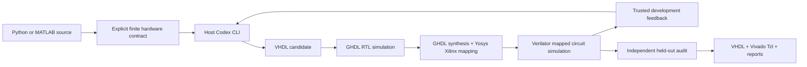

# Architecture and evidence boundaries

The initial repository contained a working normalizer design-space search, a Verilog
agent experiment with an incomplete scoreboard, and Linux-only XLS setup scripts.
The package entry point referenced a missing CLI, and no tests existed.

The working paths now share a Linux verification toolchain under Podman:

`contracts.py` specifies bus encodings, maximum latency, initiation interval, scale,
error bounds, source, and golden-vector files. `providers.py` calls `codex exec` with
a JSON schema, the user's selected model and existing authentication. It disables
shell and multi-agent tools and starts in a temporary directory; only source,
contract, development examples and prior development feedback are in the prompt.
It excludes unrelated user MCP/hook configuration. Provider logs remain on the host.

`translate.py` owns the repair loop and freezes the first passing development
candidate before opening the audit data. Audit failures are terminal and are never
fed back into model selection. Generated RTL cannot modify the trusted scorer.

`vhdl.py` generates the testbench and compares every cycle, including reset while a
job is in flight, back-to-back requests at the specified initiation interval, idle
gaps and final drain. All valid outputs must appear on the exact declared cycle.
It checks unknown values with GHDL, compares integer hashes without floating-point
conversion, and checks both absolute and RMS error for approximate arithmetic.
Verilator replays the vectors on the Xilinx-mapped circuit; this second check is
two-state and does not replace the four-state RTL check. Neither is a timing simulation.

SHA-256 uses a 768-bit input (256-bit state plus 512-bit block) and a 256-bit output.
The host performs standard padding; the FPGA core performs every compression round.
For multi-block messages the testbench feeds the actual hardware output back into
the next input. All complete message reference hashes are checked with Python's
independent `hashlib`; arbitrary-state compression cases additionally use the Python
reference. SHA-256 is integer/bitwise and says nothing about floating-point accuracy.

The normalizer demonstrates bounded-error conversion of floating-point MATLAB to
fixed-point VHDL. Its finite input domain permits exhaustive numerical testing.
`structured.py` retains the original architecture/word-length search; `emit_vhdl.py`
adds a deterministic VHDL backend. XLS remains a separate real DSLX-to-Verilog route,
executed in an x86 Linux image under Podman's Rosetta support on Apple Silicon.
The old `agent_regression.py` now uses the containerized exact-cycle scoreboard,
working replay mode, Xilinx mapping and one shared concurrency semaphore.

Tool subprocesses run in fresh networkless containers with a read-only root, dropped
capabilities, process/memory/CPU limits, and only their attempt directory mounted.
They receive no Codex credentials. Static HDL checks supplement this isolation;
this prototype is not a multi-tenant service security boundary.

## What would justify calling it SOTA?

This is a working research baseline, not evidence of state-of-the-art performance
or a compiler for unrestricted dynamic Python/MATLAB. A hardware interface requires
bounded shapes, ranges, loops and numerical semantics. The current floating-point
route produces fixed-point approximations; it does not promise general IEEE-754
NaN, infinity, subnormal or exception behavior. User-supplied reference vectors are
trusted specifications, not automatically validated programs.

The next research milestones are:

1. A held-out corpus of FIR/IIR, FFT, matrix kernels, nonlinear control and numerical
   functions, with independently generated MATLAB/Python oracles and stress domains.
2. Automatic range analysis, candidate architecture planning, interval/error bounds,
   fixed-point search, and explicit IEEE-754 mode where required.
3. Formal equivalence or exhaustive checks on tractable kernels, plus metamorphic
   checks and cross-simulator testing on larger ones.
4. Measured Vivado area and routed timing for a named part/board, with Pareto search
   over error, throughput, latency and area. Clock constraints are targets, not measurements.
5. Repeated benchmark trials reporting functional pass rates, cost, time, repair
   counts and PPA against conventional HLS and other LLM flows.

Relevant primary sources: [AutoChip](https://arxiv.org/abs/2411.11856) studies compiler
and simulator feedback; [VHDLSuite](https://arxiv.org/abs/2606.13735) supplies a
VHDL-focused benchmark/evaluation approach. These motivate the evaluation method;
this project has not run a comparative benchmark against them.
