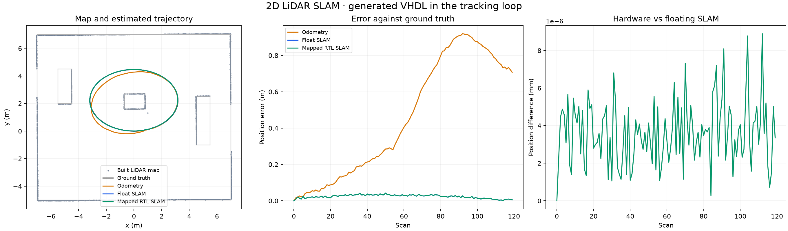
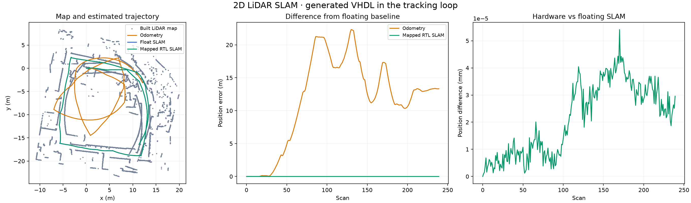

# Demonstration results

These demos show Codex turning Python and MATLAB algorithms into FPGA circuits,
testing them, and repairing failures. They cover exact integer computation,
floating-point approximation, and hardware used inside a robot mapping system.

The three translations used the Codex CLI with `gpt-6-astra` on an Apple Silicon Mac, with Linux
tools in Podman. The generated VHDL was simulated with GHDL, mapped to AMD/Xilinx
7-series logic with Yosys, then simulated again with Verilator. Results below were
recorded on **19 September 2026**. Physical board testing is the next deployment step.

## What the demos demonstrate

| Demo | Generated hardware | Result |
| --- | --- | --- |
| **SHA-256, from Python** | All 64 rounds of the hash compression algorithm | 149 complete messages matched Python `hashlib` exactly, including multi-block messages and padding boundaries. |
| **Sensor normalization, from MATLAB** | A smooth limiting function for a 12-bit sensor reading | All 4,096 inputs checked against Octave. Maximum output error: **0.0000544**, within the **0.0002** limit. |
| **2D LiDAR SLAM, from Python** | The arithmetic used to align laser scans with a growing map | **680 scans and 115,638 hardware transactions** passed across four complete tracking runs. |

The SHA-256 host pads messages and chains hardware results between blocks. For the
normalizer, Codex uses fixed-point arithmetic—a chosen number of fractional bits—and
a lookup table with interpolation. Both implementations passed on the first candidate.

## SLAM: hardware in a feedback loop

SLAM means *simultaneous localization and mapping*: estimating a robot's position
and orientation while building a map from its sensors.

Python matches laser scan points to the current map. The VHDL core processes up to
eight matches at a time, calculating equations to correct the robot's position and
orientation. Python solves them and updates the map. Each hardware result affects
later matches and position estimates, so small arithmetic errors can accumulate.
Every batch executed the generated, Xilinx-mapped circuit in simulation.

| Tracking run | Scans | SLAM position error, RMS | Motion sensors alone, RMS |
| --- | ---: | ---: | ---: |
| Simulated room, seed 41 | 120 | **2.54 cm** | 55.85 cm |
| Simulated room, seed 9827 | 160 | **2.26 cm** | 65.45 cm |
| Intel Research Lab, first segment | 240 | — | — |
| Intel Research Lab, second segment | 160 | — | — |

The simulated room tests include noisy ranges, missing beams, false returns and
drifting motion estimates. Known robot positions allow accuracy measurements;
RMS (root mean square) summarizes error over the route. The Intel recordings add
about 13 minutes of real sensor data. All scans were tracked successfully, and
hardware and software trajectories agreed within **1 µm** across all four runs.
That comparison measures numerical agreement with the floating-point reference.





The Intel data was provided by **Dirk Haehnel**, as credited by
[StachnissLab](https://www.ipb.uni-bonn.de/datasets/), and downloaded from the
[MOLA mirror](https://molaorg.github.io/mola_test_datasets/datasets/radish/) under
CC BY 3.0. These maps are derived from the selected scan segments. Additional plots:
[second simulated run](slam-assets/synthetic-audit.png),
[second Intel segment](slam-assets/intel-unseen.png).

## What pressure testing caught

- **A synthesis mismatch.** SLAM candidates passed VHDL simulation but produced
  incorrect signed arithmetic after synthesis. Simulating the mapped circuit
  caught the errors and supplied feedback to Codex. The final SLAM implementation
  passed on its third candidate, using one Codex worker.
- **Accumulating precision error.** An earlier core with 16 fractional coordinate
  bits passed isolated arithmetic tests, yet its Intel trajectory diverged from
  the floating-point version by **50.5 cm**. Increasing coordinate precision to
  24 fractional bits within the same 32-bit ports brought agreement below 1 µm.
  The tracker and acceptance thresholds stayed unchanged.

The harness checks numerical outputs, reset behavior, output order and clock-cycle
timing. Development failures drive repairs; separate audit data checks the selected
candidate. The SLAM core passed 160 development and 800 audit batches before the
full tracking runs. The complete local suite passed **38 tests**, including real
containerized simulation and synthesis.

## Circuit size and latency

LUTs implement logic, FFs store state, and DSP blocks perform arithmetic.
Latency counts clock edges from input acceptance through the result, including the acceptance edge.

| Implementation | Latency, cycles | LUTs | FFs | DSPs |
| --- | ---: | ---: | ---: | ---: |
| Codex SHA-256 | 66 | 1,565 | 1,290 | 0 |
| Codex sensor normalizer | 4 | 154 | 53 | 1 |
| Codex SLAM, per batch of up to eight matches | 58 | 2,952 | 2,361 | 12 |
| Original structured normalizer → VHDL | 1 | 90 | 17 | 2 |
| Original structured normalizer → XLS → Verilog | 4 | 92 | 75 | 1 |

The SLAM core accepts a new batch every 64 cycles. Both original normalizer paths
also passed all 4,096 inputs, with maximum error **0.0001353**. XLS provides the
separate DSLX-to-Verilog compilation path.

Counts come from Yosys mapping to Xilinx 7-series resources. The VHDL implementations
include Vivado scripts for board integration and timing measurement.

## Reproduce

After the [project setup](../README.md#setup), replay the saved Codex outputs:

```bash
uv pip install --python .venv/bin/python -e '.[test,slam]'
source .venv/bin/activate

fpga-lab demo sha256 --out runs/check-sha256 \
  --replay examples/sha256/recorded_codex.json
fpga-lab demo normalizer --octave --out runs/check-normalizer \
  --replay examples/normalizer/recorded_codex.json
fpga-lab demo slam --out runs/check-slam-core \
  --replay examples/slam/recorded_codex.json

# Run all four SLAM cases with the verified circuit
python scripts/fetch_slam_data.py
python scripts/slam_regression.py --candidate runs/check-slam-core/final \
  --carmen runs/data/intel.clf.bz2 --out runs/check-slam-tracking

FPGA_LAB_TEST_HARDWARE=1 pytest -q
```

Omit `--replay` to generate a fresh implementation; use `--rounds 4` to allow repair
attempts. Choose a fresh output directory for each run. SLAM writes maps, trajectory
plots and JSON metrics for each case; failed checks return a nonzero exit status.

Detailed evidence: [SHA-256, normalizer and XLS results](demo-results.json),
[SLAM circuit results](slam-kernel-results.json),
[SLAM tracking results](slam-results.json),
[earlier precision failure](slam-q16-results.json).
Generated VHDL: [SHA-256](../examples/sha256/sha256_core.vhd),
[normalizer](../examples/normalizer/normalizer_core.vhd),
[SLAM](../examples/slam/candidate.vhd).
